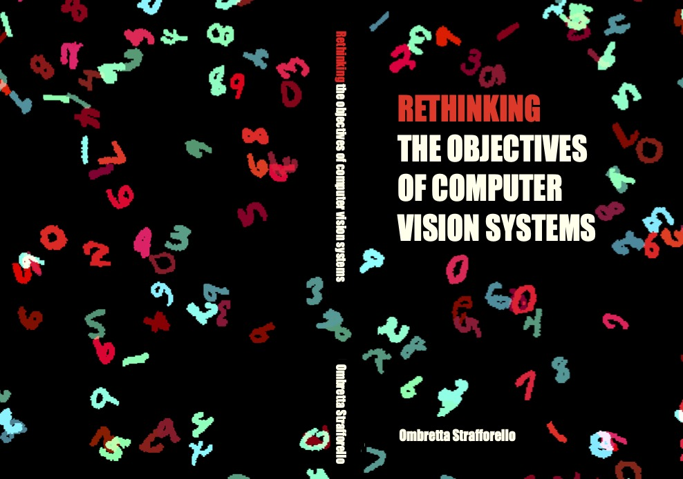

# Colorful MNIST images
This repository provides the code to create images with colourful MNIST digits, with varying amounts of hue, saturation and brightness.
I used this code to create the background of my PhD thesis cover:

More examples:

## Requirements

Before running the code, make sure you have the necessary dependencies installed: pytorch, torchvision, numpy.

## Usage

### Command-line Arguments

You can customize the image creation by passing various command-line arguments. Below is a list of the arguments you can use:

- `--n`: Number of images to create. (default: 10)
- `--n_digits`: Number of digits in one image. (default: 150)
- `--h`: Height of the generated images. (default: 907)
- `--w`: Width of the generated images. (default: 1321)
- `--digit_size`: Size of each digit in the image. (default: 50)
- `--background_color`: Background color of the images. Options: black, white. (default: black)
- `--n_hues`: Number of sampled hues (colors) to use in the digits. (default: 2)
- `--dataset_images`: The dataset to use for the digits. Options include MNIST, FashionMNIST, etc. (default: MNIST)
- `--min_hue_distance`: Minimum distance between different sampled hues. (default: 30)
- `--max_hue_noise`: Maximum hue variation for the same sampled hue. (default: 3)
- `--saturation_range`: Range for saturation variations. Provide two values indicating the range. (default: [0.5, 1.0])
- `--max_saturation_noise`: Maximum noise to add to saturation values. (default: 0.05)
- `--value_range`: Range for value (brightness) variations. Provide two values indicating the range. (default: [0.5, 1.0])
- `--max_value_noise`: Maximum noise to add to value (brightness) values. (default: 0.05)
- `--root`: Root path for the dataset folder. (default: datasets/colorMNIST/)
- `--datadir`: Directory where the generated images will be saved. (default: images/)

### Example Command

To generate 50 images with 200 digits in each, using a white background, with 3 different hues, run the following command:

`python create_images.py --n 50 --n_digits 200 --background_color white --n_hues 3`

### Output

The generated images will be saved in the directory specified by the --datadir argument.